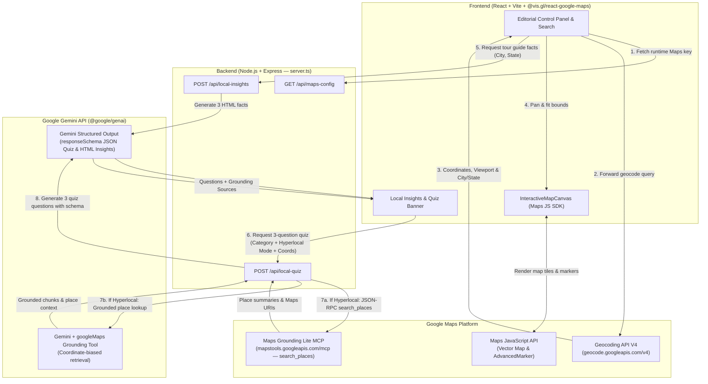

# Block Explorer

**An AI-powered destination discovery application that combines Google Maps Platform and Gemini to help people explore, understand, and test their knowledge of real-world destinations.**

**Core Experience:** `Explore → Understand → Test`

---

## 🌍 Live Demo

👉 **[Live Demo](YOUR_LIVE_DEMO_URL)**

---

## Overview

**Block Explorer** is an interactive geospatial and cultural discovery web application designed around a three-step journey: **Explore → Understand → Test**. Rather than acting as a turn-by-turn navigation or routing utility, Block Explorer pairs high-precision geospatial data from **Google Maps Platform** with contextual storytelling and grounded quiz generation from **Google Gemini**.

### What the Application Does
1. **Explore**: Search any global city, neighborhood, landmark, or street address—or jump directly into five curated global districts (*Buenos Aires*, *Shibuya*, *Copacabana*, *Cologne*, and *Lima*). Inspect a detailed **Geocoded Block Dossier** alongside an interactive vector map with custom coordinate markers, surface layer controls, and real-time zoom/camera telemetry.
2. **Understand**: As soon as a destination's locality is resolved via the Google Geocoding V4 API, the application prompts **Gemini** to act as a local tour guide and surface three concise, surprising insights about the place.
3. **Test**: Challenge your understanding with a dynamic, 3-question multiple-choice **Local Knowledge Quiz** across *Local cuisine*, *Art and culture*, or *Local history*—and toggle on **Hyperlocal mode** to ground questions in live neighborhood place data via **Google Maps Grounding Lite** and **Gemini Maps Grounding**.

### What Problem It Solves
Standard mapping tools show *where* a place is—its streets, coordinates, and boundaries—without conveying *what makes it culturally distinct*. Conversely, text-only AI chats lack spatial context, interactive map viewports, and verifiable place attributions. Block Explorer bridges this gap by turning raw coordinates and address hierarchies into an interactive cultural briefing and knowledge game.

### Who It Is For
- **Curious travelers and urban explorers** who want to learn the character, history, and culinary culture of a neighborhood before or during a visit.
- **Geography, culture, and trivia enthusiasts** looking for an interactive way to test their knowledge of global districts.
- **Developers and product teams** evaluating practical patterns for combining **Google Maps Platform (Maps JavaScript API, Geocoding API V4, Maps Grounding Lite)** with the **Google Gen AI SDK (`@google/genai`)**.

### Why Combining Geospatial Data with Generative AI Is Useful
Geospatial APIs provide canonical, structured ground truth—exact latitude/longitude coordinates, viewport bounding boxes, Place IDs, Plus Codes, and administrative hierarchies. Generative AI transforms that structured location context into engaging human narratives and interactive quizzes. When **Hyperlocal mode** is enabled, grounding the model in real Google Maps place records ensures that high-difficulty quiz questions reference authentic neighborhood institutions, streets, and landmarks with clickable Google Maps attributions.

---

## 📸 Screenshots

> _Place your 3 application screenshots at the paths below (or update the filenames to match your repo assets)._

### 1. Explore — Split-Screen Geocoded Dossier & Interactive Map

*Full split-screen view showing the Geocoded Block Dossier (coordinates, Place ID, Plus Code, viewport bounds, and address hierarchy) on the left and the interactive Google Map with custom coordinate pin and surface controls on the right.*

### 2. Understand — AI-Generated Local Insights & Category Selection

*The Local Insights banner displaying 3 Gemini-generated tour guide facts for the active destination alongside the "Test their local knowledge" category selector (`Local cuisine`, `Art and culture`, `Local history`).*

### 3. Test — Hyperlocal Mode Quiz & Google Maps Grounding Sources

*The 3-question Local Knowledge Quiz with Hyperlocal mode enabled, featuring the difficulty explainer, clickable Google Maps Grounding Sources attribution links, and graded multiple-choice answers with local explanations.*

---

## 🎯 Product Concept

Most map applications are built for **logistics**—getting from Point A to Point B as quickly as possible. **Block Explorer** is built for **place literacy and curiosity**.

```text
Explore a destination  ──►  Understand its local character  ──►  Test your knowledge
  (Geocoding V4 & Map)           (Gemini Local Insights)          (Grounded Local Quiz)
```

- **Explore**: Inspect the physical and administrative anatomy of a place—its street grid, satellite terrain, bounding box, and address hierarchy.
- **Understand**: Read a curated, bite-sized cultural briefing that highlights what makes that specific city or district surprising and memorable.
- **Test**: Actively engage with what you just explored through a category-driven trivia challenge. Turning on **Hyperlocal mode** shifts the experience from broad city-level familiarity to deep neighborhood-level discovery—testing real cafés, historic avenues, cultural institutions, and architectural landmarks verified through Google Maps grounding.

---

## ✨ Features

- **Destination Search & Geocoding V4 Integration**
  - Forward geocoding powered by the **Google Geocoding API V4** (`/v4/geocode/address/{addressQuery}`).
  - Quick-launch buttons for **5 curated global districts**: *Buenos Aires*, *Shibuya*, *Copacabana*, *Cologne*, and *Lima*.
  - Comprehensive **Geocoded Block Dossier** displaying formatted address, identified locality (`City, State/Country`), exact coordinates with one-click clipboard copy, location granularity, Place ID, Plus Code, viewport bounding box (`SW` / `NE`), and structured address components.
- **Real-World Place Discovery & Interactive Map Canvas**
  - Interactive map powered by **Google Maps JavaScript API** and `@vis.gl/react-google-maps`.
  - Custom architectural pin built with `AdvancedMarker` and an interactive `InfoWindow` displaying granularity and coordinate metadata.
  - Automatic camera panning and viewport bounding-box fitting (`fitBounds`) on location changes.
  - Map surface switcher (**Roadmap**, **Satellite**, **Hybrid**, **Terrain**), custom zoom controls, recenter button, and live camera readout (`LAT`, `LNG`, and `Zoom Level` synchronized with the control panel masthead).
- **Bookmarks & Session Gazetteer Log**
  - **Session Gazetteer Log** tracking recently geocoded destinations during the active session for instant re-selection.
  - **Saved Locations** bookmarking persisted to browser `localStorage` (with automatic 30-day cache expiration in compliance with Google Maps Platform Terms of Service).
- **AI-Generated Destination Insights**
  - Automatic **Local Insights** generation triggered once geocoding resolves a destination's city and state/region.
  - Powered by the **Gemini API** (`@google/genai`), presenting 3 concise, surprising local tour-guide facts in a collapsible bottom overlay banner with loading states and retry handling.
- **Local Knowledge Quiz**
  - Interactive **"Test their local knowledge"** quiz flow unlocked after local insights load.
  - Three selectable cultural categories: **Local cuisine**, **Art and culture**, and **Local history**.
  - Generates 3 multiple-choice questions (4 options each) using Gemini structured JSON output (`responseSchema`), complete with instant score calculation, answer validation, and per-question explanations.
- **Hyperlocal Mode (Google Maps Grounding Lite + Gemini Maps Grounding)**
  - High-difficulty **Hyperlocal mode** toggle inside the quiz panel, accompanied by an informational explainer detailing how it works and why it increases difficulty.
  - Combines the **Google Maps Grounding Lite** Model Context Protocol (MCP) `search_places` tool (`https://mapstools.googleapis.com/mcp`) and **Gemini Google Maps Grounding** (`tools: [{ googleMaps: {} }]`) biased to the destination's exact latitude/longitude coordinates.
  - Crafts granular, neighborhood-level questions testing specific streets, historic venues, architectural landmarks, and local specialties.
  - Automatic quiz regeneration when toggling Hyperlocal mode while a category is active.
- **Grounded Place & Source Attribution**
  - Extracts real-world place URIs and titles from Maps Grounding Lite results and Gemini `groundingMetadata.groundingChunks`.
  - Renders clickable Google Maps source attribution pills directly inside the quiz interface so users can inspect the referenced places on Google Maps.
- **Responsive Editorial UI & Diagnostic Error Handling**
  - Split-screen editorial layout (1/3 control panel, 2/3 interactive map canvas on desktop; stacked responsive layout on mobile and tablet viewports).
  - Structured diagnostic error banners with HTTP status codes, endpoint inspection, troubleshooting tips, and one-click retry actions for both geocoding and AI requests.

---

## 🧠 How It Works

Block Explorer uses a full-stack TypeScript architecture where an Express server serves both the Vite/React frontend and the backend AI/Maps configuration routes.

### Architecture Diagram



### Step-by-Step Data Flow

1. **Runtime Maps Configuration (`/api/maps-config`)**: On startup, the React client queries `/api/maps-config` on the Express server to retrieve the active `GOOGLE_MAPS_PLATFORM_KEY` from the server runtime environment before initializing `APIProvider` and running the initial geocode for *Buenos Aires*.
2. **Forward Geocoding (Geocoding API V4)**: When a user searches for a destination or selects a preset, `geocodeAddressV4()` sends a `GET` request to `https://geocode.googleapis.com/v4/geocode/address/{query}` with `X-Goog-FieldMask: *` and the Maps API key. The response is normalized into coordinates, viewport bounds, Place ID, Plus Code, address components, and a clean `cityAndState` string.
3. **Interactive Map Synchronization**: The `InteractiveMapCanvas` pans smoothly to the resolved coordinates, fits the map camera to the returned viewport bounding box, drops a custom `AdvancedMarker` with an `InfoWindow`, and updates the live zoom/coordinate telemetry.
4. **Local Insights Generation (`/api/local-insights`)**: Once geocoding identifies `cityAndState`, the client sends a `POST` request to `/api/local-insights`. The Express server calls Gemini (`gemini-3.8-flash` with automatic fallback to `gemini-3.1-flash-lite` and `gemini-flash-latest` on transient `503`/`429` responses) to generate 3 engaging local facts formatted as a clean HTML `<ul>` list.
5. **Local Knowledge Quiz & Hyperlocal Grounding (`/api/local-quiz`)**:
   - In **Standard Mode**, `/api/local-quiz` prompts Gemini with a strict JSON `responseSchema` to produce 3 multiple-choice questions, 4 options per question, the exact `correctAnswer`, and a 1-sentence `explanation`.
   - In **Hyperlocal Mode**, the server first executes `fetchHyperlocalGroundedData()`:
     1. It calls the **Google Maps Grounding Lite MCP** endpoint (`https://mapstools.googleapis.com/mcp`) via JSON-RPC `tools/call` (`search_places`) with a category-tailored query and an 8,000-meter `location_bias` circle centered on the destination's geocoded coordinates.
     2. It calls the **Gemini API** with the `googleMaps` grounding tool (`tools: [{ googleMaps: {} }]`) and `retrievalConfig.latLng` set to the destination's coordinates, extracting real place descriptions and `groundingChunks` URIs.
     3. Finally, it feeds the grounded place data into a second structured-output Gemini call to synthesize 3 high-difficulty, neighborhood-specific quiz questions and returns both the questions and deduplicated Google Maps attribution links to the client.

---

## 🛠️ Technology Stack

### Frontend
- **React** (`react`, `react-dom`) — Component-based UI and state management
- **TypeScript** (`typescript`) — End-to-end static typing across client and server
- **Vite** (`vite`, `@vitejs/plugin-react`) — Frontend build tooling and development middleware
- **Tailwind CSS** (`tailwindcss`, `@tailwindcss/vite`, `autoprefixer`) — Utility-first styling with editorial typography
- **Google Maps React Components** (`@vis.gl/react-google-maps`) — `APIProvider`, `Map`, `AdvancedMarker`, `InfoWindow`, and map camera hooks
- **Lucide React** (`lucide-react`) — Iconography

### Backend & AI / Geospatial Services
- **Node.js & Express** (`express`, `tsx`) — Full-stack runtime server (`server.ts`) serving API endpoints and Vite middleware
- **Google Gen AI SDK** (`@google/genai`) — Server-side Gemini API integration (`gemini-3.8-flash` with resilient fallback to `gemini-3.1-flash-lite` and `gemini-flash-latest`), structured outputs (`Type` schema), and Google Maps Grounding (`googleMaps` tool)
- **Google Maps Platform**:
  - **Maps JavaScript API** — Interactive vector/satellite map rendering and `AdvancedMarker`
  - **Geocoding API V4** — Forward address geocoding (`https://geocode.googleapis.com/v4/geocode/address/`)
  - **Maps Grounding Lite (MCP)** — JSON-RPC `search_places` grounding tool (`https://mapstools.googleapis.com/mcp`)
- **Dotenv** (`dotenv`) — Environment variable loading

---

## 🔑 Environment Variables

Configure the following environment variables in a local `.env` file (or in your cloud hosting / AI Studio Secrets manager).

| Variable Name | Required | Where Used | Description |
| :--- | :---: | :--- | :--- |
| `GOOGLE_MAPS_PLATFORM_KEY` | **Yes** | Server (`/api/maps-config`, Maps Grounding Lite) & Client (Maps JS SDK, Geocoding V4) | Google Maps Platform API key or AI Studio Maps Demo Key used to authenticate the Maps JavaScript API, Geocoding API V4, and Maps Grounding Lite MCP requests. |
| `GEMINI_API_KEY` | **Yes** | Server only (`/api/local-insights`, `/api/local-quiz`) | Google Gemini API key used by the `@google/genai` SDK on the Express backend to generate Local Insights, grounded place lookups, and quiz questions. |
| `APP_URL` | Optional | Server / Environment | Public URL where the application is hosted (automatically injected in Cloud Run / AI Studio environments). |

### Example `.env` Configuration

Create a `.env` file in the project root (you can copy `.env.example` as a starting point):

```env
GOOGLE_MAPS_PLATFORM_KEY=your_key_here
GEMINI_API_KEY=your_key_here
APP_URL=http://localhost:3000
```

> ⚠️ **Important Warning:** Never commit your `.env` file or real API keys to version control. Always keep real credentials in local untracked environment files or your deployment platform's secret manager.

---

## 🚀 Local Development

### Prerequisites
- **Node.js** (v18+ recommended; v20+ ideal)
- **npm** (included with Node.js)
- A **Google Maps Platform API Key** (with *Maps JavaScript API* and *Geocoding API* enabled, or an AI Studio Maps Demo Key)
- A **Gemini API Key** from Google AI Studio

### 1. Clone and Install Dependencies

```bash
git clone <your-repository-url>
cd <repository-folder>
npm install
```

### 2. Configure Environment Variables

Copy `.env.example` to `.env` and provide your keys:

```bash
cp .env.example .env
```

Update `.env` with your credentials:

```env
GOOGLE_MAPS_PLATFORM_KEY=your_key_here
GEMINI_API_KEY=your_key_here
```

### 3. Run the Development Server

Start the full-stack Express + Vite development server on `http://localhost:3000`:

```bash
npm run dev
```

Open `http://localhost:3000` in your browser.

### 4. Available `package.json` Scripts

- `npm run dev` — Starts the full-stack development server (`tsx server.ts`) with Vite middleware on port `3000`.
- `npm run build` — Builds the production frontend bundle into `dist/` (`vite build`).
- `npm start` — Runs the server using Node (`node server.ts`).
- `npm run preview` — Previews the Vite build (`vite preview`).
- `npm run lint` — Runs TypeScript type-checking across the project (`tsc --noEmit`).
- `npm run clean` — Removes build artifacts (`rm -rf dist server.js`).

---

## 🔐 Security

- **Never Commit API Keys**: Ensure `.env` and any local credential files remain listed in `.gitignore`. Only placeholder values (`your_key_here`) should ever appear in `.env.example` or documentation.
- **Keep Secrets in Environment Variables / Secret Management**: Store `GEMINI_API_KEY` and `GOOGLE_MAPS_PLATFORM_KEY` in environment variables or managed cloud secrets (such as AI Studio Secrets or Google Cloud Secret Manager).
- **Protect Server-Side Credentials**: `GEMINI_API_KEY` is read exclusively inside `server.ts` (`process.env.GEMINI_API_KEY`) and is never sent to or exposed in the browser bundle.
- **Apply API Restrictions to Production Keys**: When deploying to production with a standard Google Maps Platform key, restrict `GOOGLE_MAPS_PLATFORM_KEY` in the Google Cloud Console:
  - Set **Application restrictions** (HTTP referrers / websites) to your production domain.
  - Set **API restrictions** to only the specific Google Maps APIs used (*Maps JavaScript API*, *Geocoding API*, and grounding services).

---

## ⚠️ Limitations

- **Demo & Prototyping Quotas**: When running with a prototyping/demo key or free-tier Gemini API quota, rate limits (`429 RESOURCE_EXHAUSTED`) or temporary model capacity spikes (`503 UNAVAILABLE`) may occur. While the backend includes automatic model fallback (`gemini-3.8-flash` → `gemini-3.1-flash-lite` → `gemini-flash-latest`), heavy concurrent traffic requires production billing quotas.
- **Service Availability Dependence**: Core functionality depends on network connectivity and the availability of Google Maps Platform endpoints (`maps.googleapis.com`, `geocode.googleapis.com`, `mapstools.googleapis.com`) and the Gemini API.
- **AI-Generated Content Verification**: Local Insights and quiz questions are generated dynamically by large language models. Even with Google Maps grounding enabled in Hyperlocal mode, historical dates, cultural trivia, or venue details may occasionally require independent verification.
- **Browser-Local Bookmark Persistence**: Saved locations are stored in the user's browser `localStorage` (`block_explorer_saved_locations_v1`) and automatically expire after 30 calendar days in accordance with Google Maps Platform caching guidelines. Bookmarks do not sync across different devices or browsers, and the *Session Gazetteer Log* resets on page refresh.

---

## 🙏 Acknowledgements

- **[Google Maps Platform](https://developers.google.com/maps)** for the Maps JavaScript API, Geocoding API V4, and Maps Grounding Lite MCP tools.
- **[Google Gemini API & `@google/genai` SDK](https://ai.google.dev/)** for powering the Local Insights tour guide, Google Maps grounding, and structured multiple-choice quiz generation.
- **[`@vis.gl/react-google-maps`](https://visgl.github.io/react-google-maps/)** for declarative React bindings for the Google Maps JavaScript API.

---

## 📄 License

Source code files in this repository include the `SPDX-License-Identifier: Apache-2.0` header, though a standalone root `LICENSE` file has not yet been added. If you plan to publish or distribute this repository publicly, please add a formal `LICENSE` file (such as Apache 2.0 or MIT) that matches your intended distribution terms.
